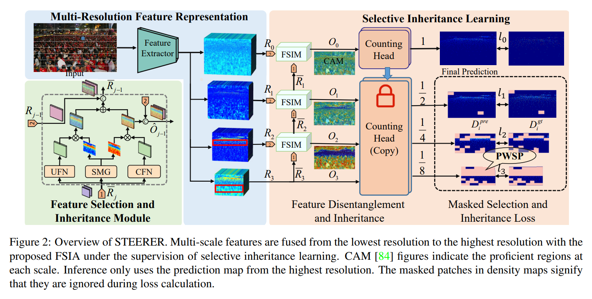

# STEERER for Object Counting and Localizaiotion (ICCV 2023)
## Introduction
This is the official PyTorch implementation of paper: [**STEERER: Resolving Scale Variations for Counting and Localization via Selective Inheritance Learning**](https://arxiv.org/abs/2308.10468), which effectively addressed the issue of scale variations for object counting and localizaioion, demonstrating the state-of-arts counting and localizaiton performance for different catagories, such as crowd,vehicle, crops and trees . 

# Catalog
- [x] Training and Testing Code (18/08/2023)
- [x] Pretrained models for SHHB, JHU, TRANSCOS, MTC, TREE (30/10/2023)
- [x] Pretrained models for NWPU, QNRF (coming soon)


# Getting started 

## preparation 

- **Clone this repo** in the directory (```root/```):


```bash
cd $root
git clone https://github.com/yooongjin/crowd_counting_steerer.git
```
- **Install dependencies.** We use python 3.9 and pytorch >= 1.12.0 : http://pytorch.org.

```bash
conda create -n STEERER python=3.9 -y
conda activate STEERER
conda install pytorch==1.12.0 torchvision==0.13.0 cudatoolkit=11.3 -c pytorch
cd ${STEERER}
pip install -r requirements.txt
pip install decord
```

## Video Inference

```bash
python video_inference.py  --pretrained [PRETRAINED_MODEL] --sample_rate [SAMPLE_RATE] --output_path [OUTPUT_PATH] --batch_size [BATCH_SIZE] --video_path [VIDEO_PATH] 
```
